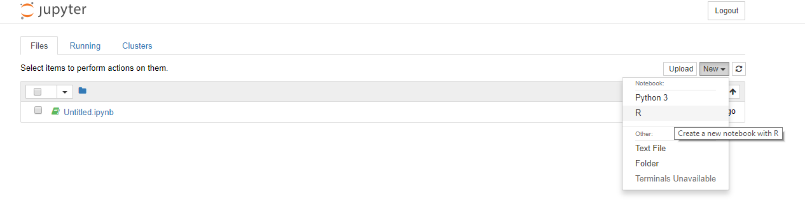
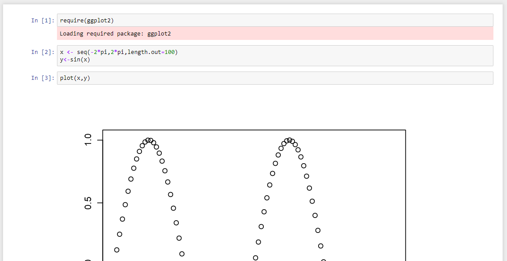
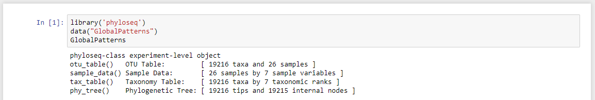

# Requirements
1. Anaconda
1. R
1. Phyloseq and other R packages
1. RStudio (Optional)
1. Phyloseq_demo_notebooks.zip file


# Installing Anaconda
1. [Download and install the Python 3.7 (or greater) version appropriate for you system](https://www.anaconda.com/download/)
1. Open the *Anaconda Command Prompt*
1. Test your install by typing ```conda list```. This should print a list of installed packages
1. Create a new anaconda environment by typing ```conda create -n phylo_demo python=3.7``` and answering yes to all prompts
1. Activate the environment by typing ```activate phylo_demo```

* Adapted from the [Anaconda installation guide](https://conda.io/docs/user-guide/install/windows.html)

# Preparing the Jupyter Notebook
1. Within the *Anaconda Command Prompt*, using the ```phylo_demo``` environment, type the following:
    * ```conda install nb_conda```
    * ```conda install ipykernel```
    * ```jupyter notebook```
1. A web browser should open and load the Jupyter file browser
    1. You may have to reload the anaconda environment for this work. A straighforward way to do this is to close the command prompt, open it again, and re-activate ```phylo_demo```.
1. To exit Jupyter, in the *Anaconda Command Prompt*, type ```Ctrl-C``` twice


# Installing R
1. [Download and install the latest version of R for your system](http://cran.mtu.edu/)
    1. Further installation instructions are available at: <https://cran.r-project.org/doc/manuals/r-release/R-admin.html#Installing-R-under-Windows>
1. To test your installation, open a new *Anaconda Command Prompt*, activate the ```phylo_demo``` environment, and try to start the R interepreter
    1. Under windows R will be located under a path *similar to*: ```c:\program files\R\R-3.4.2\bin\R.exe```
1. Make R available to Jupyter  (instructions from <https://irkernel.github.io/installation/>)
    1. In the intrepreter enter the following lines: (If prompted for a CRAN mirror, select a nearby location).
        * ```install.packages(c('repr', 'IRdisplay', 'evaluate', 'crayon', 'pbdZMQ', 'devtools', 'uuid', 'digest'))```
        * ```devtools::install_github('IRkernel/IRkernel')```
        * ```IRkernel::installspec()```
    
# Installing phyloseq and other R packages
1. Install the phyloseq package (instructions from <https://joey711.github.io/phyloseq/install.html>)
    1. In the intrepreter enter the following lines:  (Update all packages if prompted).
        * ```source('http://bioconductor.org/biocLite.R')```
        * ```biocLite('phyloseq')```
        * ```packageVersion('phyloseq')```
1. The previous line tests the installation and should print phyloseq's version, *similar* to ```## [1] '1.22.3'```
1. In the interpreter install other packages by typing: ```install.packages(c('tidyverse', 'rlang', 'assertthat'))```
1. Exit the R interpreter by typing ```quit(save="no")``` 
1. Close the *Anaconda Command Prompt*

# Installing RStudio (Optional)
1. We will not be using RStudio for the demo, but it is the primary environment in which you will develop R code when not in a jupyter notebook
1. Installation instructions at <https://www.rstudio.com/products/rstudio/download/#download>

# Testing Jupyter
1. Download a zip of this repository and extract to local location of your choice  (or clone it, if you are comfortable with ```git```)
1. Within a new *Anaconda Command Prompt*, using the ```phylo_demo``` environment change to the ```phyloseq_notebooks``` directory of  your local copy
1. Start an interactive Jupyter session by typing ```jupyter notebook```
1. This should open a web browser pointing to the jupyter notebook session.
1. Ensure Jupyter understands R by clicking on the 'new' button, you should see an option to create a new notebook in R, like below:
    
1. Load the ```simple_r_test.ipynb``` notebook in Jupyter by clicking on it
1. Run the test by clicking ```Cell``` -> ```Run All```
1. You should see some output like:
    
1. Load the ```simple_phylo_test.ipynb``` in Jupyter
1. Run the test
1. You should see something like:
    

# Phyloseq demo
1. At this point, you should be able to run the demo
1. If you still have Jupyter open, load ```phylo_demo.ipnyb```
1. Otherwise open an *Anaconda Command Prompt*, activate the ```phylo_demo``` environment, and start a Jupyter session
1. Follow the instructions in the notebook to learn how to use phyloseq to analyze genomic data
1. Stuck?
    1. On Jupyter itself?   <http://nbviewer.jupyter.org/github/jupyter/notebook/blob/master/docs/source/examples/Notebook/Notebook%20Basics.ipynb>
    1. Figuring out what answers to put into the demo? a filled in version is at ```phylo_demo_completed.ipynb```. Try as much as possible to solve it yourself first, though
1. Want to learn more phyloseq? Extensive tutorials at: <https://joey711.github.io/phyloseq/index.html>, [For example](https://joey711.github.io/phyloseq/plot_tree-examples.html#example).
